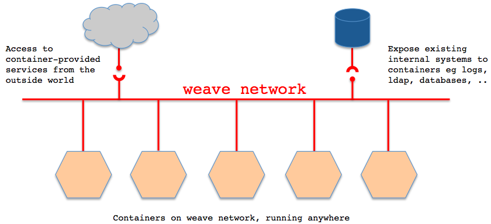
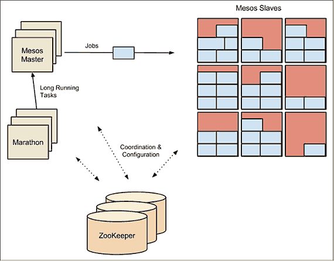
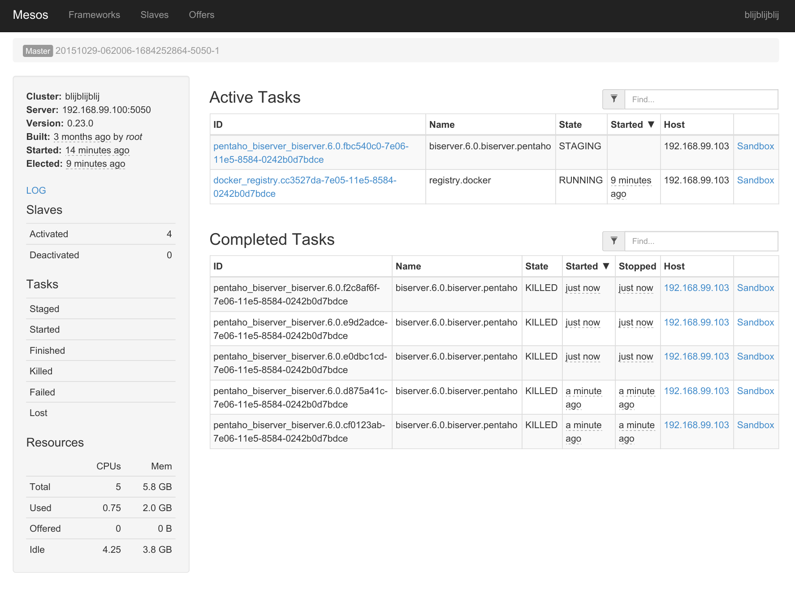
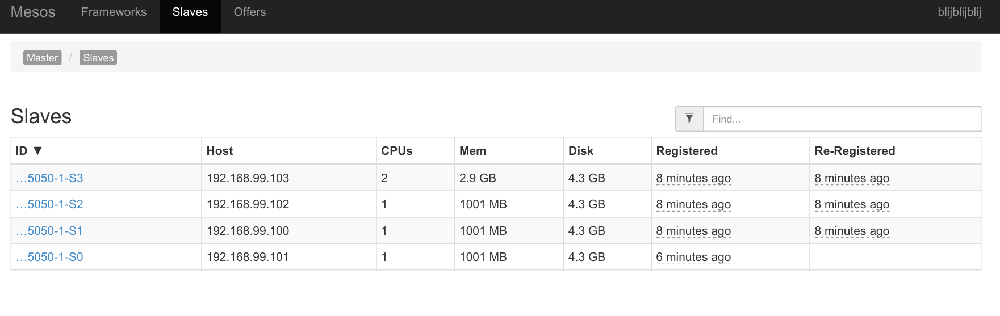
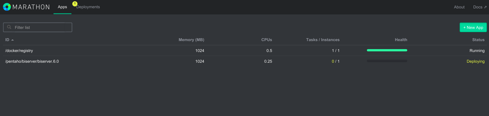

# pcm15-hackaton
So, a hackaton, at the pentaho community meeting, in London, with beeeeeeeer!

Nice!

Or something more concrete:

- [ ] One Software defined network covering multiple host and / or geo locations: Weave
- [ ] One Data center OS abstracted layer running on top of these hosts: Mesos
- [ ] One scheduler scheduling tasks as services (:Marathon) or batch commands :(Chronos)
- [ ] Service tasks beiing containerized pentaho applications, etl & biserver, supportive databases, datamarts

# Weave

 http://weave.works/guides/weave-and-docker-platform/weavenetwork.html

# Mesos, Marathon and Chronos
source: http://radar.oreilly.com/2015/10/swarm-v-fleet-v-kubernetes-v-mesos.html?cmp=tw-webops-na-article-na_orchestration

*Apache Mesos (https://mesos.apache.org) is an open-source cluster manager. It’s designed to scale to very large clusters involving hundreds or thousands of hosts. Mesos supports diverse workloads from multiple tenants; one user’s Docker containers may be running next to another user’s Hadoop tasks.*

*Apache Mesos was started as a project at the University of California, Berkeley before becoming the underlying infrastructure used to power Twitter and an important tool at many major companies such as eBay and Airbnb. A lot of continuing development in Mesos and supporting tools (such as Marathon) is undertaken by Mesosphere, a company co-founded by Ben Hindman, one of the orginal developers of Mesos.*

*The architecture of Mesos is designed around high-availability and resilience. The major components in a Mesos cluster are:*

+ ***Mesos Agent Nodes** – Responsible for actually running tasks. All agents submit a list of their available resources to the master. There will typically be 10s to 1000s of agent nodes.*

+ ***Mesos Master** – The master is responsible for sending tasks to the agents. It maintains a list of available resources and makes “offers” of them to frameworks. The master decides how many resources to offer based on an allocation strategy. There will typically be 2 or 4 stand-by masters ready to take over in case of a failure.*

+ ***ZooKeeper** – Used in elections and for looking up address of current master. Typically 3 or 5 ZooKeeper instances will be running to ensure availability and handle failures.*

+ ***Frameworks** – Frameworks co-ordinate with the master to schedule tasks onto agent nodes. Frameworks are composed of two parts; the executor process which runs on the agents and takes care of running the tasks and the scheduler which registers with the master and selects which resources to use based on offers from the master. There may be multiple frameworks running on a Mesos cluster for different kinds of task. Users wishing to submit jobs interact with frameworks rather than directly with Mesos.*

*Here we see a Mesos cluster which uses the Marathon framework as the scheduler. The Marathon scheduler uses ZooKeeper to locate the current Mesos master which it will submit tasks to. Both the Marathon scheduler and the Mesos master have stand-bys ready to start work should the current master become unavailable.*

*Typically, ZooKeeper will run on the same hosts as the Mesos master and its standbys. In a small cluster, these hosts may also run agents, but larger clusters require communication with the master, making this less feasible. Marathon may run on the same hosts as well, or may instead run on separate hosts which live on the network boundary and form the access point for clients, thus keeping clients separated from the Mesos cluster itself.*

*Marathon (from Mesosphere) is designed to start, monitor and scale long-running applications. Marathon is designed to be flexible about the applications it launches, and can even be used to start other complementary frameworks such Chronos (“cron” for the datacenter). It makes a good choice of framework for running Docker containers, which are directly supported in Marathon. Like the other orchestration frameworks we’ve looked at, Marathon supports various affinity and constraint rules. Clients interact with Marathon through a REST API. Other features include support for health checks and an event stream that can be used to integrate with load-balancers or for analyzing metrics.*

# Marathon

=
